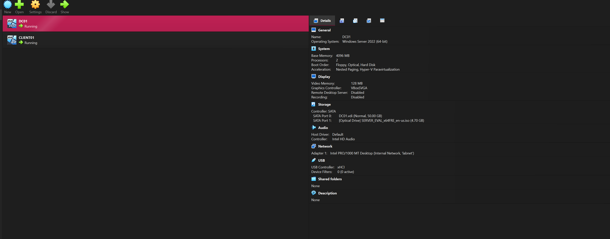
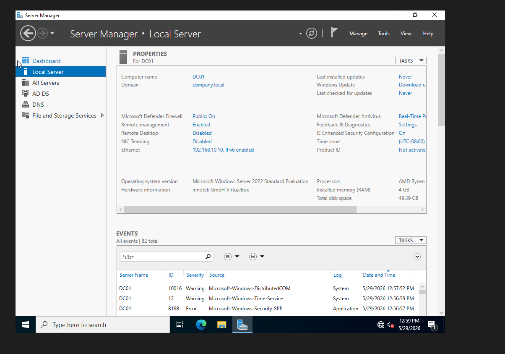
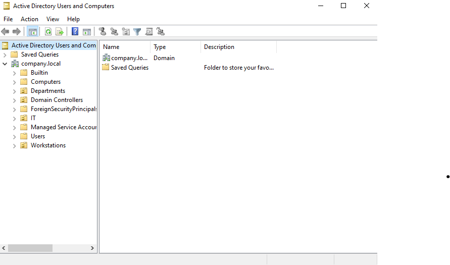
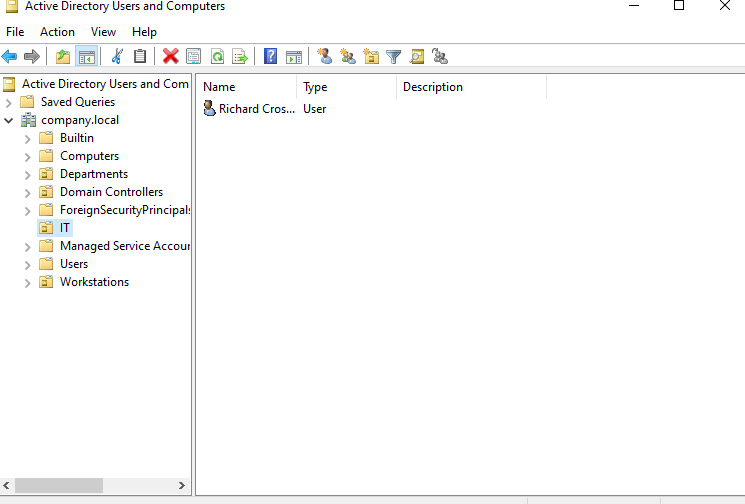
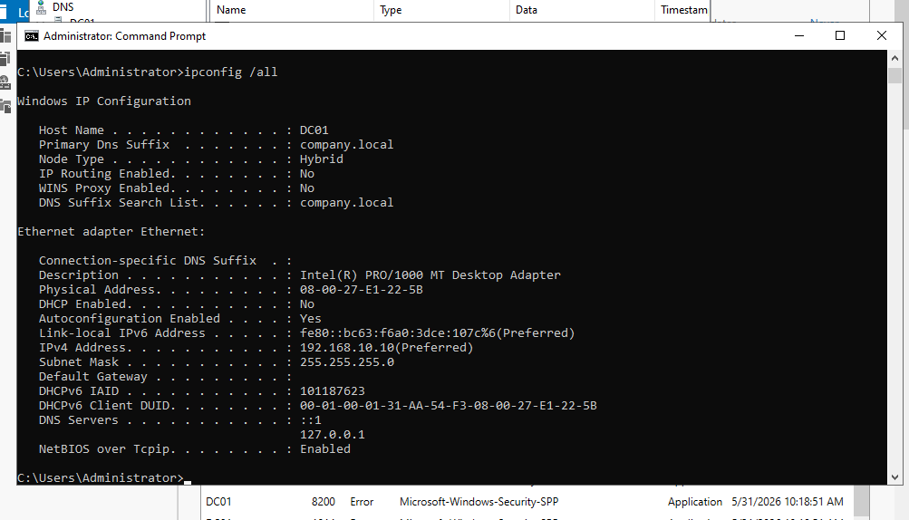
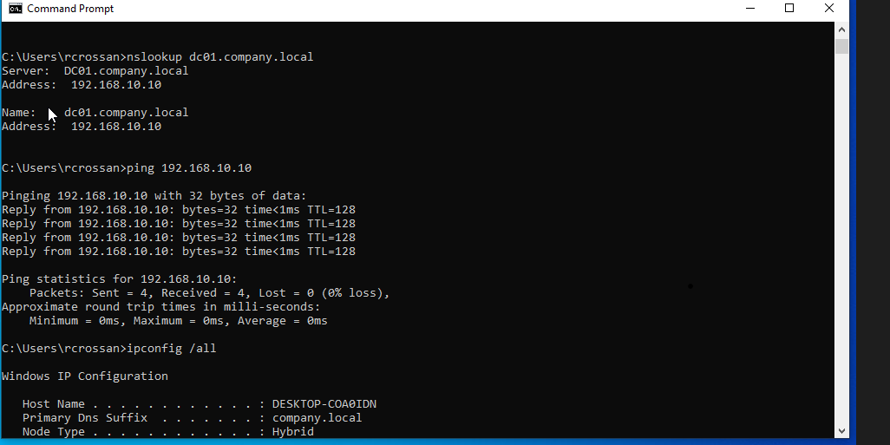
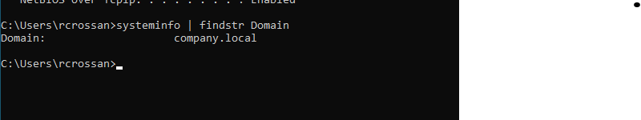
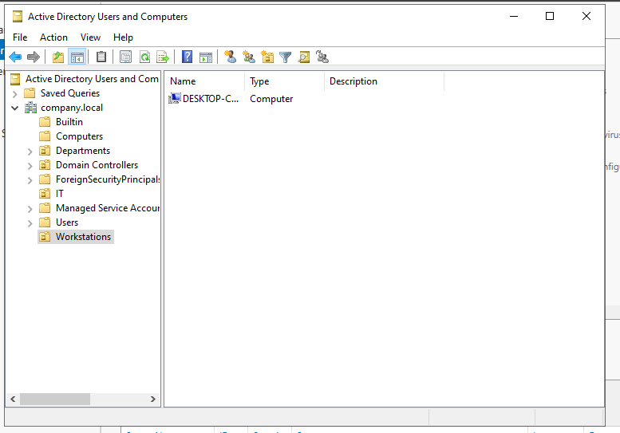

# Active Directory Home Lab

## Project Overview

This project documents the deployment of a small Active Directory lab environment using Oracle VirtualBox, Windows Server 2022, and Windows 10.

The purpose of this lab is to practice core IT support and system administration tasks including Windows Server setup, Active Directory Domain Services (AD DS), DNS configuration, domain user management, workstation deployment, and network troubleshooting.

---

## Technologies Used

* Windows Server 2022
* Windows 10 Pro
* Active Directory Domain Services (AD DS)
* DNS (Domain Name System)
* Oracle VirtualBox
* TCP/IP Networking
* Command Prompt (CMD)

---

## Lab Environment

| System   | Role                           | Operating System    | IP Address    |
| -------- | ------------------------------ | ------------------- | ------------- |
| DC01     | Domain Controller / DNS Server | Windows Server 2022 | 192.168.10.10 |
| CLIENT01 | Domain-Joined Workstation      | Windows 10 Pro      | 192.168.10.20 |

### Domain Name

```text
company.local
```

---

## Network Architecture

```text
                    company.local

                 +----------------+
                 |      DC01      |
                 | Domain Control |
                 | DNS Server     |
                 | 192.168.10.10  |
                 +--------+-------+
                          |
                          |
                Internal Network
                    (labnet)
                          |
                          |
                 +--------+-------+
                 |    CLIENT01    |
                 | Windows 10 Pro |
                 | 192.168.10.20  |
                 +----------------+
```

---

## Active Directory Configuration

### Organizational Units Created

The following Organizational Units (OUs) were created to organize users and computers within the domain:

* Departments
* IT
* Workstations

### User Management

A domain user account was created and placed within the IT Organizational Unit.

**User Created:**

```text
Richard Crossan
```

### Computer Management

The Windows 10 workstation was successfully joined to the company.local domain and added to Active Directory.

---

## DNS Configuration

DNS was configured on the Domain Controller to provide name resolution for domain resources.

### Forward Lookup Zone

Configured:

```text
company.local
```

### Reverse Lookup Zone

Configured:

```text
10.168.192.in-addr.arpa
```

### DNS Testing

Successful DNS resolution was verified using:

```cmd
nslookup company.local
```

```cmd
nslookup dc01.company.local
```

---

## Network Connectivity Testing

Connectivity between the workstation and Domain Controller was verified using ICMP testing.

Command used:

```cmd
ping 192.168.10.10
```

Results:

* Successful communication
* No packet loss
* DNS resolution functioning properly

---

## Domain Join Verification

The Windows 10 workstation was successfully joined to the company.local domain.

Verification command:

```cmd
systeminfo | findstr Domain
```

Result:

```text
Domain: company.local
```

---

# Screenshots

## Lab Overview



## Domain Controller Configuration



## Active Directory Structure



## Domain User



## DC01 Network Configuration



## DNS Resolution Test



## Client Connectivity Test



## Workstations OU



---

## Skills Demonstrated

* Active Directory Domain Services (AD DS)
* DNS Administration
* Organizational Unit (OU) Management
* User Account Administration
* Computer Object Management
* Domain Controller Deployment
* Windows Server 2022 Administration
* Windows 10 Domain Joining
* TCP/IP Networking
* DNS Troubleshooting
* Network Troubleshooting
* Virtualization with Oracle VirtualBox
* Command Line Administration

---

## Lessons Learned

During this lab, I gained hands-on experience configuring a Windows Server environment, deploying Active Directory Domain Services, managing users and computers, configuring DNS zones, troubleshooting name resolution issues, and joining Windows workstations to a domain.

This project strengthened my understanding of core IT support, system administration, and networking concepts commonly used in enterprise environments.
